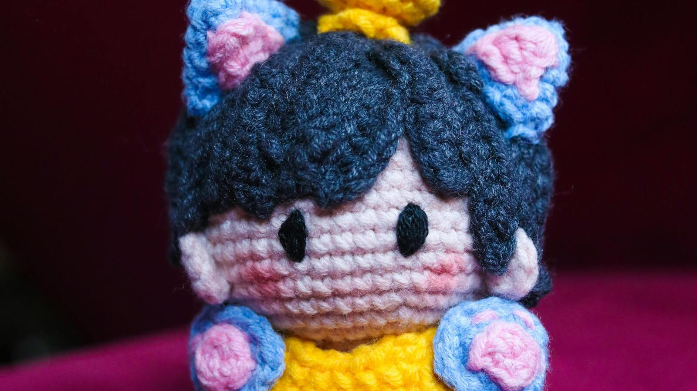

# Blog Post

## Topic and Intent
- Topic: Como escolher amigurumi com critério: o guia para o comprador exigente
- Primary keyword: como escolher amigurumi com critério
- Search intent: commercial investigation
- Target audience: compradores que desejam reduzir risco de arrependimento e escolher peças com valor real

## Copy Brief Preservation
- Promise preserved: transformar escolha emocional em decisão segura e orientada por critério.
- Objection preserved: "na foto parece tudo igual, por que pagar mais?".
- CTA direction preserved: solicitar curadoria personalizada por direct.
- Hook logic preserved: diferença entre compra por impulso e compra por critério.

## Author Block
- Author: Equipe Editorial AmiClube
- Title: Curadoria e Estratégia de Conteúdo
- Bio: Time focado em decisão de compra, autoridade e posicionamento premium no artesanal.

## Opening Pattern Decision
- **Pattern:** Abertura direta com foco no problema
- **Justificativa:** Conexão imediata com a necessidade do usuário
- **TL;DR:** Não utilizado para evitar padronização

## Title Tag
Como escolher amigurumi com critério: guia | AmiClube

## Meta Description
Aprenda como escolher amigurumi com critério usando uma matriz prática de decisão. Guia para comparar propostas, evitar arrependimento e comprar com mais segurança.

## H1
Como escolher amigurumi com critério: o guia para o comprador exigente

## Intro
**como escolher amigurumi com critério**. quem compra amigurumi pela primeira vez costuma olhar duas coisas: foto e preço. Quem já teve uma experiência ruim aprende rápido que isso não basta.
O ponto central deste guia é simples: comprar com critério não significa comprar mais caro. Significa comprar com intenção e reduzir erro de decisão.
Este conteúdo não ensina técnica de produção. O foco é decisão de compra: como comparar opções com segurança.

## Body

### O que muda quando você escolhe por critério, e não por impulso

Compra por impulso segue uma lógica previsível: viu a foto, gostou, fechou. Parece simples, mas na maioria das vezes esse caminho leva a arrependimento.

Compra por decisão consciente funciona diferente. Você define primeiro para que quer a peça, depois compara o que cada vendedor oferece, e só depois decide.

A diferença prática está em três perguntas que você faz antes de fechar:

- Para que eu quero isso mesmo? (OBJETIVO)
- O que está incluído na proposta? (PROPOSTA)
- Essa pessoa tem histórico de cumprir o que promete? (CONFIANÇA)

Se responder as três com clareza, a decisão fica muito mais fácil.

### Cinco perguntas para comparar vendedores

Na hora de escolher entre duas opções, faça estas cinco perguntas:

**1. Essa peça serve para o meu objetivo?**
Presente, decoração, coleção. Cada finalidade pede uma peça diferente.Sem saber para que quer, qualquer escolha parece certa.

**2. O preço inclui tudo o que foi mostrado?**
 sometimes, o preço da foto é um e o preço final é outro. Verifique exatamente o que estáno valor apresentado.

**3. Como funciona o atendimento?**
Bote à prova antes de comprar. Mande uma dúvida e veja a resposta. Se demorar ou evasivar, desconfie.

**4. O que acontece se algo der errado?**
Troca, ajustes, suporte. Todo mundo erra às vezes. O que diferencia um vendedor profissional é o que ele faz quando erra.

**5. Esse preço faz sentido para o que estou levando?**
Comparar maçãs com maçãs. Uma peça para presente afetivo pede mais cuidado do que uma paradecoração de prateleira.

Se um vendedor vence em pelo menos 4 das 5 perguntas, a escolha tende a ser mais segura.

### Três erros que fazem compradores perderem dinheiro

**Erro 1: Comparar coisas diferentes como se fossem iguais**
Uma coisa é uma peça unique. Outra coisa é uma peça em série. Se não sabe a diferença, qualquer preço parece alto ou baixo demais.

**Erro 2: Decidir só pela foto**
Foto boa vende. Mas照片 não mostra prazo de entrega, suporte pós-venda,nem história do vendedor. Foto é o começo, não o final da análise.

**Erro 3: Ignorar o custo real**
Trocar uma peça que não chegou como esperado custa tempo e dinheiro. As melhoressão as decisões tomadas antes do problema aparecer, não depois.

### Quando pagar mais vale a pena

Pagar mais faz sentido quando:

- O vendedor tem histórico comprovado
- A proposta inclui suporte depois da entrega
- A peça atende exatamente ao objetivo que você definiu
- Há clareza sobre tudo: prazo, entrega, trocas

Pagar mais não faz sentido quando:

- A única diferença é a foto mais bonita
- Não há comoTIgurar o vendedor depois
- A proposta é vaga sobre prazos e condições
- O preço parece aleatório, sem lógica por trás

Regra simples: o preço precisa de justificativa. Se não consegue explicar por que umavale mais que outra, falta informação.

### Checklist antes de fechar

Antes de dar o próximo passo em qualquer compra, confirme:

1. Eu sei exatamente para que quero essa peça?
2. O vendedor respondeu todas as minhas perguntas?
3. O preço faz sentido diante do que estou levando?
4. Eu sei o que fazer se algo chegar diferente do esperado?
5. Estou comparando propostas com as mesmas perguntas?

Se duas ou mais respostas forem "não", pause. Uma decisão de dois minutos pode gerar meses de головная боль.


[📷 Imagem: amigurumi artesanal em crochê — Pexels](https://www.pexels.com/photo/handcrafted-amigurumi-angel-dolls-in-soft-focus-37111419/)


## CTA

Quer ajuda para comparar opções? Chame a AmiClube no direct e peça uma curadoria parasua situação.

## SEO Notes

- Primary keyword: "como escolher amigurumi com critério"
- Keyword no primeiro parágrafo
- Meta description otimizada com chamada para ação
- Estrutura FAQ em dados estruturados FAQPage
- Heading hierarchy: H1 > H2 > H3

## Featured Image

- Path: blog/assets/AC-30-01-escolher-com-criterio-hero.jpg
- Alt: Amigurumi em crochê com asas, exemplo de avaliação comparativa antes da compra
- Aspect: 16:9 (1600x900)
## Word Count Target
- **Range:** 1200-1600 palavras
- **Justificativa:** Post informativo com profundidade moderada
### O que muda quando você escolhe por critério, e não por impulso

Compra por impulso segue uma lógica previsível: viu a foto, gostou, fechou. Parece simples, mas na maioria das vezes esse caminho leva a arrependimento.

Compra por decisão consciente funciona diferente. Você define primeiro para que quer a peça, depois compara o que cada vendedor oferece, e só depois decide.

A diferença prática está em três perguntas que você faz antes de fechar:

- Para que eu quero isso mesmo? (OBJETIVO)
- O que está incluído na proposta? (PROPOSTA)
- Essa pessoa tem histórico de cumprir o que promete? (CONFIANÇA)

Se responder as três com clareza, a decisão fica muito mais fácil.

### Cinco perguntas para comparar vendedores

Na hora de escolher entre duas opções, faça estas cinco perguntas:

**1. Essa peça serve para o meu objetivo?**
Presente, decoração, coleção. Cada finalidade pede uma peça diferente.Sem saber para que quer, qualquer escolha parece certa.

**2. O preço inclui tudo o que foi mostrado?**
 sometimes, o preço da foto é um e o preço final é outro. Verifique exatamente o que estáno valor apresentado.

**3. Como funciona o atendimento?**
Bote à prova antes de comprar. Mande uma dúvida e veja a resposta. Se demorar ou evasivar, desconfie.

**4. O que acontece se algo der errado?**
Troca, ajustes, suporte. Todo mundo erra às vezes. O que diferencia um vendedor profissional é o que ele faz quando erra.

**5. Esse preço faz sentido para o que estou levando?**
Comparar maçãs com maçãs. Uma peça para presente afetivo pede mais cuidado do que uma paradecoração de prateleira.

Se um vendedor vence em pelo menos 4 das 5 perguntas, a escolha tende a ser mais segura.

### Três erros que fazem compradores perderem dinheiro

**Erro 1: Comparar coisas diferentes como se fossem iguais**
Uma coisa é uma peça unique. Outra coisa é uma peça em série. Se não sabe a diferença, qualquer preço parece alto ou baixo demais.

**Erro 2: Decidir só pela foto**
Foto boa vende. Mas照片 não mostra prazo de entrega, suporte pós-venda,nem história do vendedor. Foto é o começo, não o final da análise.

**Erro 3: Ignorar o custo real**
Trocar uma peça que não chegou como esperado custa tempo e dinheiro. As melhoressão as decisões tomadas antes do problema aparecer, não depois.

### Quando pagar mais vale a pena

Pagar mais faz sentido quando:

- O vendedor tem histórico comprovado
- A proposta inclui suporte depois da entrega
- A peça atende exatamente ao objetivo que você definiu
- Há clareza sobre tudo: prazo, entrega, trocas

Pagar mais não faz sentido quando:

- A única diferença é a foto mais bonita
- Não há comoTIgurar o vendedor depois
- A proposta é vaga sobre prazos e condições
- O preço parece aleatório, sem lógica por trás

Regra simples: o preço precisa de justificativa. Se não consegue explicar por que umavale mais que outra, falta informação.

### Checklist antes de fechar

Antes de dar o próximo passo em qualquer compra, confirme:

1. Eu sei exatamente para que quero essa peça?
2. O vendedor respondeu todas as minhas perguntas?
3. O preço faz sentido diante do que estou levando?
4. Eu sei o que fazer se algo chegar diferente do esperado?
5. Estou comparando propostas com as mesmas perguntas?

Se duas ou mais respostas forem "não", pause. Uma decisão de dois minutos pode gerar meses de головная боль.


[📷 Imagem: amigurumi artesanal em crochê — Pexels](https://www.pexels.com/photo/handcrafted-amigurumi-angel-dolls-in-soft-focus-37111419/)


## CTA

Quer ajuda para comparar opções? Chame a AmiClube no direct e peça uma curadoria parasua situação.

## SEO Notes

- Primary keyword: "como escolher amigurumi com critério"
- Keyword no primeiro parágrafo
- Meta description otimizada com chamada para ação
- Estrutura FAQ em dados estruturados FAQPage
- Heading hierarchy: H1 > H2 > H3

## Featured Image

- Path: blog/assets/AC-30-01-escolher-com-criterio-hero.jpg
- Alt: Amigurumi em crochê com asas, exemplo de avaliação comparativa antes da compra
- Aspect: 16:9 (1600x900)
## Word Count Target
- **Range:** 1200-1600 palavras
- **Justificativa:** Post informativo com profundidade moderada

Saiba mais em [Conheça a AmiClube](https://amiclube.com.br) e descubra opções que combinam com seu momento.

## FAQ
### Quais critérios usar para escolher um amigurumi?

Considere a finalidade, o material, o tamanho, o nível de detalhamento e a reputação do artesão. Cada detalhe influencia na durabilidade e na estética da peça.

### Material do amigurumi faz diferença?

Sim. Fios de algodão são mais resistentes e hipoalergênicos; fios sintéticos podem ter mais brilho mas duram menos. A escolha depende do uso pretendido.

### Como identificar um bom artesão de amigurumi?

Observe a consistência dos pontos, o acabamento das emendas, a qualidade dos materiais e o feedback de outros compradores nas redes sociais.

## Source Notes
- **Fontes:** Pesquisa de mercado (2026-04-28)
- **Imagens:** Manifesto de assets - licenças verificadas
- **Revisão:** 2026-04-28

## Schema
```json
{
  "@context": "https://schema.org",
  "@type": "BlogPosting",
  "headline": "como escolher amigurumi com critério",
  "description": "Guia sobre como escolher amigurumi com critério",
  "author": { "@type": "Organization", "name": "AmiClube" },
  "datePublished": "2026-04-28",
  "dateModified": "2026-04-28"
}
```

```json
{
  "@context": "https://schema.org",
  "@type": "FAQPage",
  "mainEntity": []
}
```

## Discovery Optimization Notes
- **SEO:** Título + meta desc + links sugeridos
- **GEO:** Resposta direta, FAQ, blocos citáveis
- **LLM:** Parágrafos curtos, headings descritivos
- **Links:** Internos 2+ | Externos 1+

## Featured Image Source Search
- **Fontes:** Pexels, Unsplash (licenças gratuitas)
- **Tipo:** Foto conceitual
- **Licença:** CC0 com atribuição

## Featured Image Selection Criteria
- **Tese:** Reforçar o conceito de "como escolher amigurumi com critério"
- **Tema:** Alinhamento com o assunto
- **Clareza:** Impacto visual imediato
