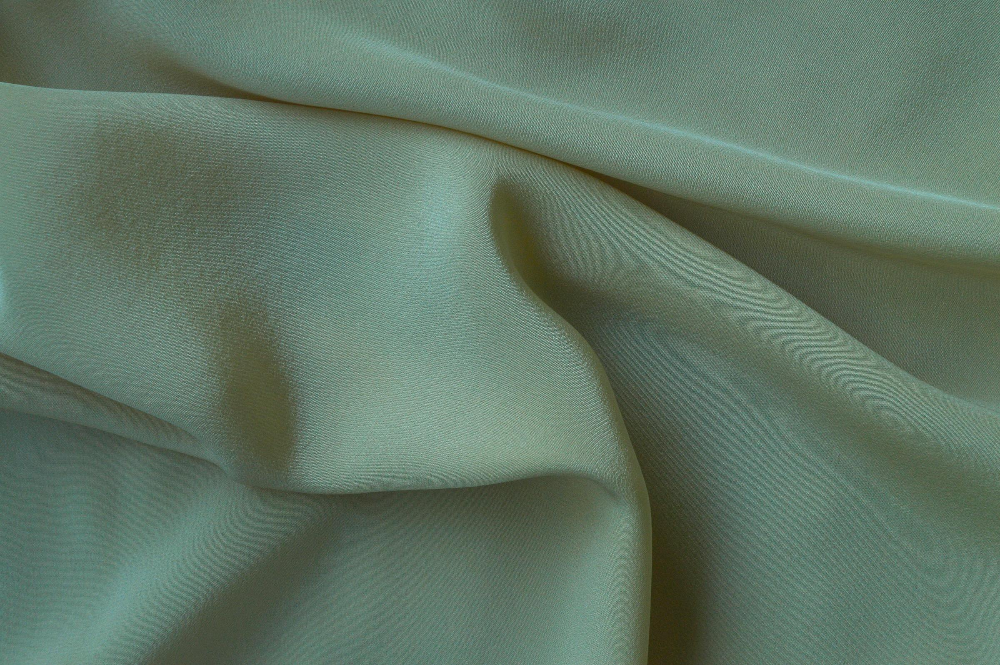

# Blog Post

## Topic and Intent
- Topic: Tendências 2026: Por que o veludo é o novo luxo
- Primary keyword: amigurumi de veludo luxo
- Search intent: informational + commercial investigation
- Target audience: compradores que buscam peças artesanais premium para decoração, presente e coleção com foco em valor percebido

## Copy Brief Preservation
- Promise preserved: entender por que o veludo ganhou protagonismo em 2026 e como isso impacta escolha, valor e posicionamento.
- Objection preserved: “veludo é só estética passageira, não muda a decisão”.
- CTA direction preserved: solicitar curadoria de peças em veludo para contexto de uso real.
- Hook logic preserved: o mercado migrou de luxo visual para luxo sensorial e experiencial.

## Opening Pattern Decision
- Pattern: abertura contrária à intuição (não é sobre moda rápida, é sobre experiência de valor).
- Justification: o leitor tende a tratar “tendência” como algo superficial; o texto mostra fundamento de decisão e posicionamento.

## Author Block
- Author: Equipe Editorial AmiClube
- Title: Inteligência de Mercado e Curadoria
- Bio: Time focado em decisão de compra, autoridade de marca e leitura de tendências aplicadas ao artesanal premium.
- Updated: 2026-04-22

## Title Tag
Amigurumi de veludo luxo | AmiClube

## Meta Description
Amigurumi de veludo luxo: Veja por que o veludo virou referência de luxo em 2026 no amigurumi e como avaliar valor percebido, contexto de uso e diferenciação an

## H1
Tendências 2026: Por que o veludo é o novo luxo

## Intro
**amigurumi de veludo luxo**. em 2026, o luxo deixou de ser apenas o que se vê. Ele passou a ser, cada vez mais, o que se sente. No mercado artesanal premium, essa mudança ficou clara: materiais com presença tátil e profundidade visual ganharam espaço em decisões de compra mais exigentes.
Nesse cenário, o veludo se consolidou como um dos sinais mais fortes de valor percebido no amigurumi. Não por ser “da moda”, mas por responder a uma demanda real de quem compra com mais critério: experiência, conforto sensorial e sofisticação de ambiente.
Este artigo não ensina execução técnica de peça. O objetivo é ajudar você a interpretar essa tendência com visão de negócio e decisão de compra: quando o veludo faz sentido, como ele altera percepção de valor e quais critérios usar para escolher com segurança.

## Body

### H2: O que mudou no mercado para o veludo ganhar protagonismo
O consumidor premium de 2026 está menos interessado em novidade vazia e mais interessado em coerência de experiência. Em outras palavras: não basta uma peça “bonita na foto”. Ela precisa sustentar valor no ambiente real.

Três movimentos explicam esse reposicionamento:
1. busca por ambientes mais acolhedores e sensoriais;
2. preferência por peças com assinatura e identidade visual forte;
3. maior maturidade na comparação entre preço e valor entregue.

O veludo entra como resposta direta a esses três pontos. Ele oferece leitura estética sofisticada, reforça sensação de conforto e ajuda a diferenciar peça autoral de item genérico.

### H2: Veludo como linguagem de posicionamento, não como detalhe de acabamento
Quando uma marca artesanal usa veludo de forma coerente, ela não está apenas escolhendo um material. Está declarando posicionamento.

Essa linguagem comunica:
- curadoria mais criteriosa;
- intenção de gerar percepção de luxo tátil;
- proposta voltada a experiência e não só utilidade imediata.

Por isso, o veludo funciona como marcador de categoria. Ele ajuda o comprador a entender rapidamente se aquela peça foi pensada para competir por preço ou por valor percebido.

### H2: Por que o veludo aumenta valor percebido no contexto certo
Valor percebido não nasce de uma etiqueta. Ele nasce da combinação entre proposta, ambiente e expectativa. O veludo tende a elevar valor percebido quando existe alinhamento entre esses elementos.

No contexto certo, ele agrega:
1. **profundidade visual**: a peça ganha presença e leitura de sofisticação;
2. **apelo sensorial**: o toque reforça sensação de aconchego e cuidado;
3. **efeito de destaque**: em composições de ambiente, a peça ocupa papel de ponto focal;
4. **memória de marca**: materiais com assinatura tátil facilitam lembrança e recomendação.

Sem contexto, porém, esse ganho pode se perder. É por isso que comprar por tendência isolada é arriscado. Comprar por aderência de uso é o que sustenta valor.

### H2: Quando o veludo não é a melhor escolha
Uma leitura madura de tendência também inclui limite e nuance. Veludo não é solução universal.

Ele pode não ser ideal quando:
- o objetivo é apenas preço de entrada;
- o ambiente exige linguagem visual totalmente minimalista e sem ponto de textura;
- a rotina de cuidado esperada não combina com o perfil do comprador;
- a decisão está sendo feita por impulso, sem critério de uso.

Reconhecer isso protege o cliente de frustração e protege a marca de promessa desalinhada. Em posicionamento premium, dizer “não é para todo caso” aumenta credibilidade.

### H2: Como avaliar uma proposta em veludo com critério
Se você está comparando opções, use uma matriz simples antes de decidir.

1. **Uso principal da peça**
Decoração de destaque? Presente com valor simbólico? Coleção? O uso define o peso de cada critério.

2. **Coerência com o ambiente**
A peça conversa com paleta, iluminação e linguagem do espaço?

3. **Experiência esperada**
A proposta entrega aquilo que o comprador busca: aconchego, sofisticação, exclusividade, presença visual?

4. **Nível de diferenciação**
Há assinatura clara da marca ou parece apenas variação superficial de catálogo?

5. **Coerência preço x proposta**
O preço está justificado pelo conjunto de valor percebido e não apenas pelo argumento “material premium”?

Com essa lógica, a decisão deixa de ser “gosto/não gosto” e passa a ser “faz sentido para meu objetivo?”.

### H2: O impacto do veludo na estratégia comercial da marca artesanal
No lado da marca, o veludo pode funcionar como alavanca de posicionamento e margem quando é tratado com estratégia.

Principais impactos:
- melhora de narrativa de valor;
- maior clareza de segmento premium;
- redução de disputa direta por preço;
- aumento de potencial de conteúdo de autoridade;
- fortalecimento de recomendação boca a boca por experiência diferenciada.

Mas isso só acontece quando a comunicação acompanha a proposta. Sem argumentação de valor, até uma peça premium pode ser percebida como “cara”.

### H2: Tendência forte não elimina necessidade de curadoria
Uma armadilha comum é confundir tendência com atalho. Em mercados de alto critério, tendência sem curadoria vira repetição.

Curadoria, neste caso, significa:
1. selecionar propostas coerentes com perfil de cliente;
2. contextualizar uso e expectativa antes da compra;
3. orientar decisão com critérios equivalentes;
4. preservar identidade da marca acima do efeito “novidade”.

AmiClube ganha vantagem quando trata veludo como parte de uma tese de valor, não como efeito de campanha.

### H2: Checklist de decisão para 2026
Antes de fechar uma compra em veludo, valide:

1. Eu sei qual papel essa peça terá no ambiente?
2. A proposta comunica luxo sensorial de forma coerente?
3. A diferenciação é real ou apenas estética de superfície?
4. O valor percebido está claro além da etiqueta?
5. Estou comprando por critério ou por urgência?

Se duas respostas forem “não”, vale pausar e revisar opções.

### H2: Como transformar tendência em compra inteligente
A tendência do veludo em 2026 é uma oportunidade para escolher melhor, não para comprar mais rápido. O ganho real vem quando a decisão combina contexto, proposta e expectativa de experiência.

Em resumo:
- veludo é forte quando reforça identidade e conforto sensorial;
- perde força quando usado sem curadoria;
- cria valor sustentável quando a escolha é orientada por objetivo, não por impulso.

Esse é o ponto de maturidade: tratar tendência como dado estratégico de decisão.
### H2: O que mudou no mercado para o veludo ganhar protagonismo
O consumidor premium de 2026 está menos interessado em novidade vazia e mais interessado em coerência de experiência. Em outras palavras: não basta uma peça “bonita na foto”. Ela precisa sustentar valor no ambiente real.

Três movimentos explicam esse reposicionamento:
1. busca por ambientes mais acolhedores e sensoriais;
2. preferência por peças com assinatura e identidade visual forte;
3. maior maturidade na comparação entre preço e valor entregue.

O veludo entra como resposta direta a esses três pontos. Ele oferece leitura estética sofisticada, reforça sensação de conforto e ajuda a diferenciar peça autoral de item genérico.

### H2: Veludo como linguagem de posicionamento, não como detalhe de acabamento
Quando uma marca artesanal usa veludo de forma coerente, ela não está apenas escolhendo um material. Está declarando posicionamento.

Essa linguagem comunica:
- curadoria mais criteriosa;
- intenção de gerar percepção de luxo tátil;
- proposta voltada a experiência e não só utilidade imediata.

Por isso, o veludo funciona como marcador de categoria. Ele ajuda o comprador a entender rapidamente se aquela peça foi pensada para competir por preço ou por valor percebido.

### H2: Por que o veludo aumenta valor percebido no contexto certo
Valor percebido não nasce de uma etiqueta. Ele nasce da combinação entre proposta, ambiente e expectativa. O veludo tende a elevar valor percebido quando existe alinhamento entre esses elementos.

No contexto certo, ele agrega:
1. **profundidade visual**: a peça ganha presença e leitura de sofisticação;
2. **apelo sensorial**: o toque reforça sensação de aconchego e cuidado;
3. **efeito de destaque**: em composições de ambiente, a peça ocupa papel de ponto focal;
4. **memória de marca**: materiais com assinatura tátil facilitam lembrança e recomendação.

Sem contexto, porém, esse ganho pode se perder. É por isso que comprar por tendência isolada é arriscado. Comprar por aderência de uso é o que sustenta valor.

### H2: Quando o veludo não é a melhor escolha
Uma leitura madura de tendência também inclui limite e nuance. Veludo não é solução universal.

Ele pode não ser ideal quando:
- o objetivo é apenas preço de entrada;
- o ambiente exige linguagem visual totalmente minimalista e sem ponto de textura;
- a rotina de cuidado esperada não combina com o perfil do comprador;
- a decisão está sendo feita por impulso, sem critério de uso.

Reconhecer isso protege o cliente de frustração e protege a marca de promessa desalinhada. Em posicionamento premium, dizer “não é para todo caso” aumenta credibilidade.

### H2: Como avaliar uma proposta em veludo com critério
Se você está comparando opções, use uma matriz simples antes de decidir.

1. **Uso principal da peça**
Decoração de destaque? Presente com valor simbólico? Coleção? O uso define o peso de cada critério.

2. **Coerência com o ambiente**
A peça conversa com paleta, iluminação e linguagem do espaço?

3. **Experiência esperada**
A proposta entrega aquilo que o comprador busca: aconchego, sofisticação, exclusividade, presença visual?

4. **Nível de diferenciação**
Há assinatura clara da marca ou parece apenas variação superficial de catálogo?

5. **Coerência preço x proposta**
O preço está justificado pelo conjunto de valor percebido e não apenas pelo argumento “material premium”?

Com essa lógica, a decisão deixa de ser “gosto/não gosto” e passa a ser “faz sentido para meu objetivo?”.

### H2: O impacto do veludo na estratégia comercial da marca artesanal
No lado da marca, o veludo pode funcionar como alavanca de posicionamento e margem quando é tratado com estratégia.

Principais impactos:
- melhora de narrativa de valor;
- maior clareza de segmento premium;
- redução de disputa direta por preço;
- aumento de potencial de conteúdo de autoridade;
- fortalecimento de recomendação boca a boca por experiência diferenciada.

Mas isso só acontece quando a comunicação acompanha a proposta. Sem argumentação de valor, até uma peça premium pode ser percebida como “cara”.

### H2: Tendência forte não elimina necessidade de curadoria
Uma armadilha comum é confundir tendência com atalho. Em mercados de alto critério, tendência sem curadoria vira repetição.

Curadoria, neste caso, significa:
1. selecionar propostas coerentes com perfil de cliente;
2. contextualizar uso e expectativa antes da compra;
3. orientar decisão com critérios equivalentes;
4. preservar identidade da marca acima do efeito “novidade”.

AmiClube ganha vantagem quando trata veludo como parte de uma tese de valor, não como efeito de campanha.

### H2: Checklist de decisão para 2026
Antes de fechar uma compra em veludo, valide:

1. Eu sei qual papel essa peça terá no ambiente?
2. A proposta comunica luxo sensorial de forma coerente?
3. A diferenciação é real ou apenas estética de superfície?
4. O valor percebido está claro além da etiqueta?
5. Estou comprando por critério ou por urgência?

Se duas respostas forem “não”, vale pausar e revisar opções.

### H2: Como transformar tendência em compra inteligente
A tendência do veludo em 2026 é uma oportunidade para escolher melhor, não para comprar mais rápido. O ganho real vem quando a decisão combina contexto, proposta e expectativa de experiência.

Em resumo:
- veludo é forte quando reforça identidade e conforto sensorial;
- perde força quando usado sem curadoria;
- cria valor sustentável quando a escolha é orientada por objetivo, não por impulso.

Esse é o ponto de maturidade: tratar tendência como dado estratégico de decisão.

Saiba mais em [Conheça a AmiClube](https://amiclube.com.br) e descubra opções que combinam com seu momento.

## FAQ
### O veludo é tendência passageira no amigurumi?
Em 2026, os sinais apontam uso consistente em posicionamento premium, especialmente quando há foco em experiência sensorial e valor percebido.

### Veludo sempre significa peça mais cara?
Não necessariamente. O relevante é a coerência entre proposta, contexto de uso e diferenciação real.

### Como saber se uma peça em veludo vale o investimento?
Avalie uso, ambiente, proposta de valor, assinatura da marca e clareza de expectativa antes de comparar preço.

### Essa tendência serve para qualquer perfil de compra?
Não. Perfis focados apenas em preço de entrada podem não capturar o ganho completo de valor percebido.

### Qual é o maior erro ao seguir tendência?
Comprar pelo efeito de novidade sem critérios de aderência ao objetivo real da peça.

## Source Notes
- Pauta AmiClube 30 dias com item `AC-30-05B` (tese de luxo sensorial e posicionamento).
- Backlog editorial com prioridade P1 para o tema “veludo como novo luxo”.
- Diretrizes de veto do cliente aplicadas: sem tutorial técnico, sem passo a passo, sem receita.
- Pesquisa de imagem realizada em fonte free/public (Pexels) com seleção orientada à tese visual do artigo.

## Schema
- BlogPosting JSON-LD recomendado para publicação final.
- FAQPage JSON-LD recomendado por presença de FAQ com perguntas objetivas.
- Metadados de autor e entidade devem seguir o perfil AmiClube.

## Conclusion
O veludo virou novo luxo no amigurumi porque responde a uma mudança real de comportamento: pessoas querem beleza com experiência, não apenas aparência com promessa.

Quando essa tendência é aplicada com curadoria, ela fortalece posicionamento, aumenta valor percebido e melhora decisão de compra. Quando é aplicada sem critério, vira só ruído de mercado.

**CTA:** quer saber quais peças em veludo fazem sentido para seu contexto? Solicite curadoria da AmiClube e receba uma seleção orientada por uso, ambiente e proposta de valor.

## Discovery Optimization Notes
- SEO: keyword principal distribuída em título, introdução, seções de decisão e FAQ.
- GEO: estrutura com respostas diretas, matriz prática, checklist e conclusão acionável.
- LLM readability: blocos curtos, listas claras e linguagem sem jargão técnico de execução.
- Internal links sugeridos: AC-30-01 (critério de compra), AC-30-05 (preço x valor), AC-30-01B (ergonomia e cuidado).
- External links sugeridos: fontes de tendências de consumo e design sensorial para reforço de contexto.

## Structural Preservation Notes
- Arc preservado: mudança de mercado -> valor percebido -> limites -> matriz de decisão -> impacto comercial -> checklist -> CTA.
- Estrutura evita molde tutorial e mantém foco em inteligência de compra e posicionamento.
- Diferenciação: este artigo trata tendência/material como linguagem de valor; AC-30-05 trata objeção preço/valor.

## Word Count Target
- Range: 1200-1600
- Rationale: conteúdo de consideração estratégica com densidade para contexto, nuance e decisão.

## Featured Image
- Visual concept: macro de textura de veludo com luz lateral suave, comunicando luxo sensorial e profundidade visual.
- Format: blog-hero-16x9 (1600x900)
- Alt text: Close-up de textura de veludo premium em tons sofisticados, representando o novo luxo sensorial em 2026.
- Implementation note: usar `assets/AC-30-05b-veludo-luxo-hero.jpg` no topo do preview.
- Source class: free/public stock (Pexels)

## Featured Image Source Search
- Candidate source type: Pexels (free/public), Unsplash (free use), Pixabay (free use).
- Search query used: `Pexels velvet texture close up photo`.
- Chosen source: Pexels photo id `8465936`.
- Source page: https://www.pexels.com/photo/8465936/
- Download URL used: https://images.pexels.com/photos/8465936/pexels-photo-8465936.jpeg?auto=compress&cs=tinysrgb&w=2400
- License note: Pexels License (free to use; attribution not required).
- License check date: 2026-04-22.
- Rejected options: fotos genéricas sem textura de veludo evidente e imagens sem leitura de luxo sensorial.

## Featured Image Selection Criteria
- Why best thesis match: textura e brilho do veludo são visíveis de imediato, reforçando a tese de luxo sensorial.
- Why not generic: o foco em material premium evita semântica de preço e destaca a mudança de categoria do produto.
- One-glance job: comunicar “novo luxo” antes mesmo da leitura do primeiro parágrafo.

## Family Ledger Entry
- family name: tendência de mercado com matriz decisória
- opening shape: quebra de expectativa (“tendência não é moda vazia”)
- proof placement: movimentos de mercado + matriz de avaliação + limites de uso
- nuance placement: quando o veludo não é a melhor escolha
- close shape: checklist e CTA consultivo
- neighboring-post guardrail: não repetir eixo de objeção de preço do AC-30-05

## Skill Execution Evidence
- blog-writer: `copywriting` + `write-seo-geo-content`
- discovery-optimizer: `seo-2025-expert` + `write-seo-geo-content`
- workflow-governance: estrutura canônica preservada conforme contrato de saída
- client-scoped path maintained in `output/amiclube/blog/*`
